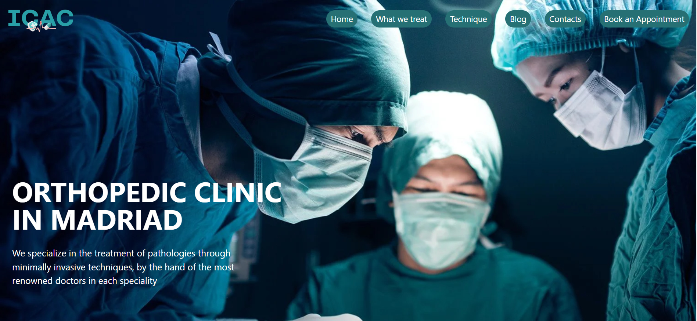
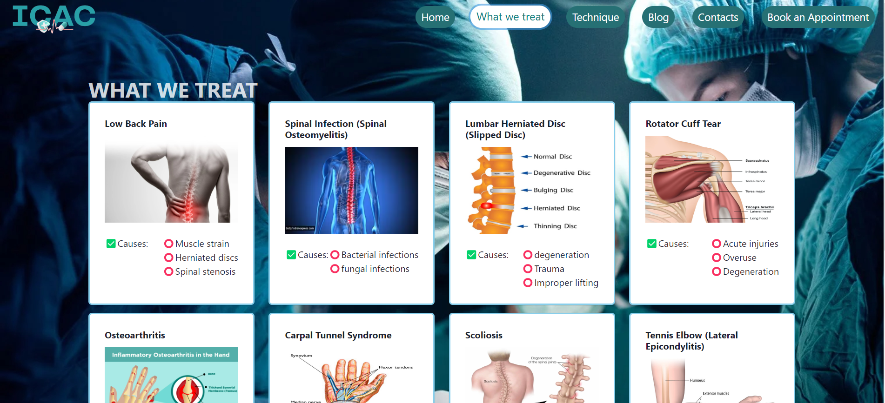
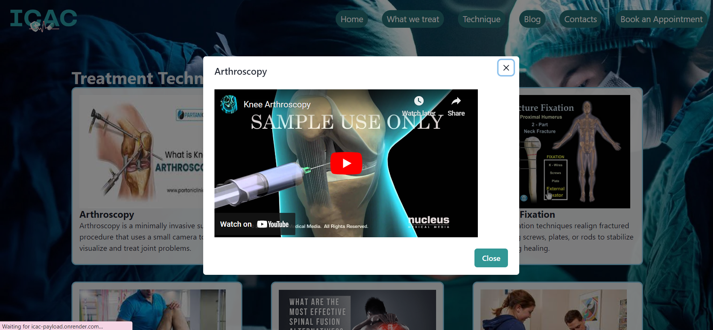

# ICAC (Intelligent Care Access Center)

### Netlify Link: https://icachealthcare.netlify.app/

### Tech-Stack Used: React,node.js,Chakra-UI

### Overview of Website:

#### By leveraging the power of React and Chakra UI, I have created an Orthopedic Clinic website that not only reflects the clinic's commitment to top-notch patient care but also showcases my abilities as a web developer. This individual project demonstrates my proficiency in front-end development, user interface design, and the integration of practical features that cater to real-world needs. The result is a user-centric website that effectively bridges the gap between patients and quality orthopedic healthcare.

#### Landing Page:

#### Treatement Page:

#### Techniques Page:

#### Blog Page:

#### Contact Page:

#### Appoinment Form:

# *******THANK YOU*******
